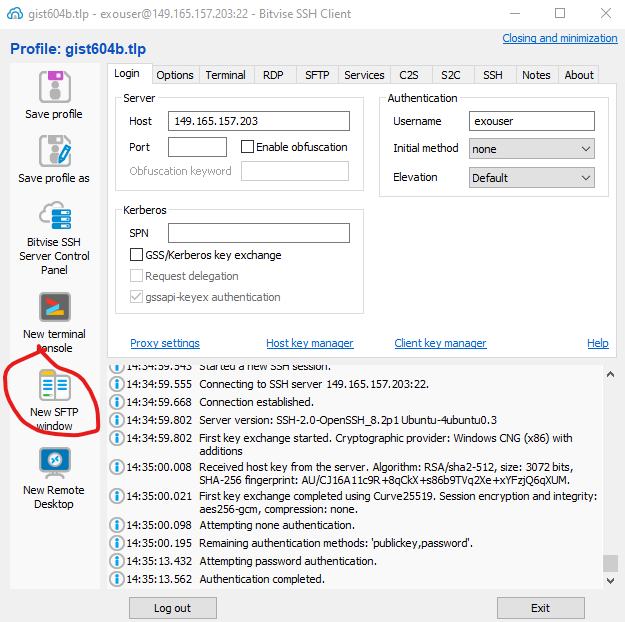
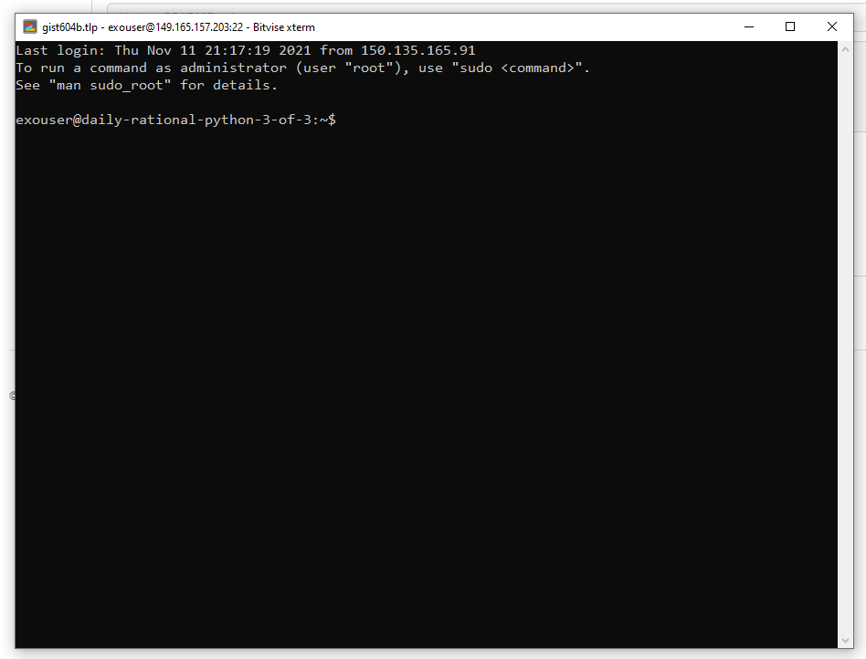

# VM Test

## Directions
0. Clone this repo to your local computer using GitHub Desktop.

1. Download and install [Bitvise SSSH Client Installer](https://www.bitvise.com/ssh-client-download).

2. Open bitvise and "Log in" with the IP, username, and password sent to you in a separate communication.

3. Save the profile

4. Open a new Bitvise FTP window

This will bring up a new SFTP window showing your local files on the left and the remove files on the right.
Local files are on your computer. Remote files are on the remote Virtual Machine. 

You can use the `Upload` button on the bottom left of the `Local files` panel to upload local files to the VM.

You can use the `Download` button on the bottom of the `Remote files` panel to download files from the VM to your local machine.

You can navigate between directories by using the controls above the file list but below the `Local files` and `Remote files` labels.

5. Navigate to the directory where this repo is checked out.

6. On your local machine, using Notepad++ or another text editor, modify the file names `name.txt` by adding your name. 

7. `Upload` the file `name.txt` to the remote VM.

8. Setting the SFTP window aside for a moment, return to the Bitvise SSH Client and open a `New terminal console`.
This opens a new terminal session connected to the VM. The terminal will have a prompt containing your username `exouser`, the name
of the machine (in the example below it is 

