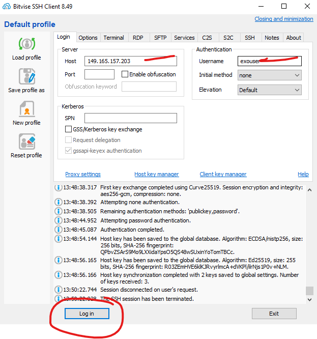
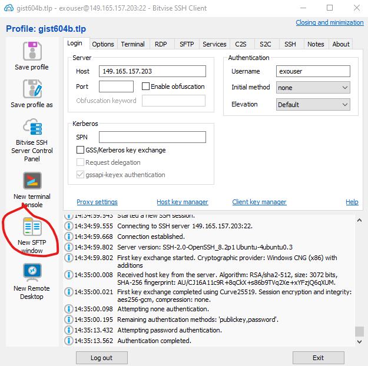
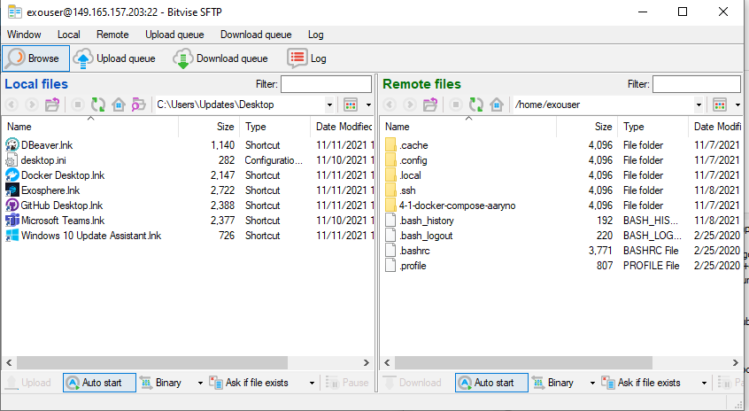
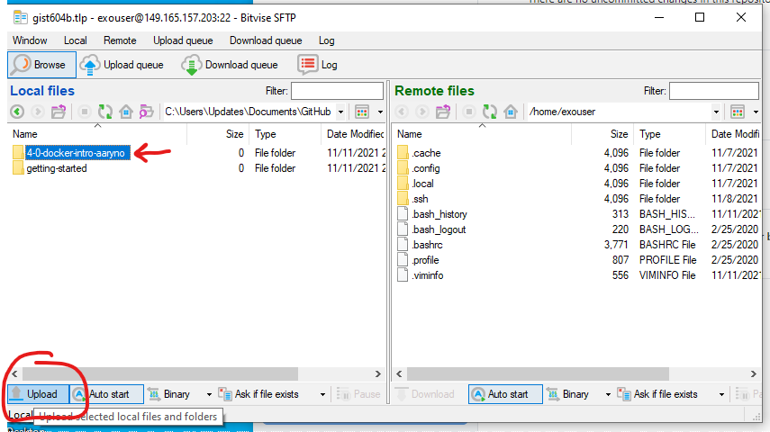
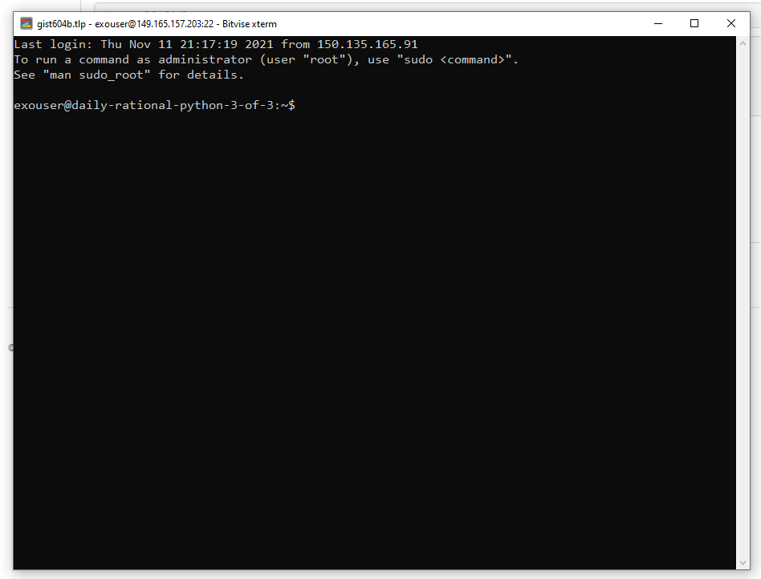

# VM Test

## Directions
0. Clone this repo to your local computer using GitHub Desktop and make a new branch named `vm`

1. Download and install [Bitvise SSSH Client Installer](https://www.bitvise.com/ssh-client-download).

2. Open bitvise and "Log in" with the IP, username, and password sent to you in a separate communication.

3. Save the profile

4. Open a new Bitvise FTP window

This will bring up a new SFTP window showing your local files on the left and the remove files on the right.
Local files are on your computer. Remote files are on the remote Virtual Machine. 

You can use the `Upload` button on the bottom left of the `Local files` panel to upload local files to the VM.

You can use the `Download` button on the bottom of the `Remote files` panel to download files from the VM to your local machine.

You can navigate between directories by using the controls above the file list but below the `Local files` and `Remote files` labels.

5. Navigate to the directory where this repo is checked out.

6. Upload the directory of this repo (something like `100-0-vm-setup-aaryno`) to the remote. In the example below, I am uploading the directory named `4-0-docker-intro-aaryno`. 

After uploading, you'll see the directory on the Remote side:

7. Setting the SFTP window aside for a moment, return to the Bitvise SSH Client and open a `New terminal console`.
This opens a new terminal session connected to the VM. The terminal will have a prompt containing your username `exouser`, the name
of the machine (in the example below it is the poorly named `daily-rational-python-3-of-3`

8. Type `ls` to get a directory listing. Note that you will see the directory you uploaded. Let's change to that directory:

9. Type `cd $DIR` where `$DIR` is the name of your directory seen in the output from step 8.

10. Type `ls` to get the listing of the repo directory that you uploaded.

*Take a screenshot of your local terminal window and name it `screenshot1.png`, saving it to your local repo*

Now that you have seen that you can upload files to the remote, let's show how we can make local edits and update them.

11. On your local machine, create a new file named `new-file.txt` in your local copy of this github repo.

12. Repeat steps 5 and 6 to push a new copy of your local directory to the remote VM. This will include your `new-file.txt`.

13. On the remote machine, via terminal, you should still be in the repo directory. Type `ls` to see that `new-file.txt` is there.

*Take a screenshot of the terminal window and name it `screenshot2.png`, saving it to your local repo*

14. Submit a new Pull Request to merge the `vm` branch containing the two screenshots you added.
